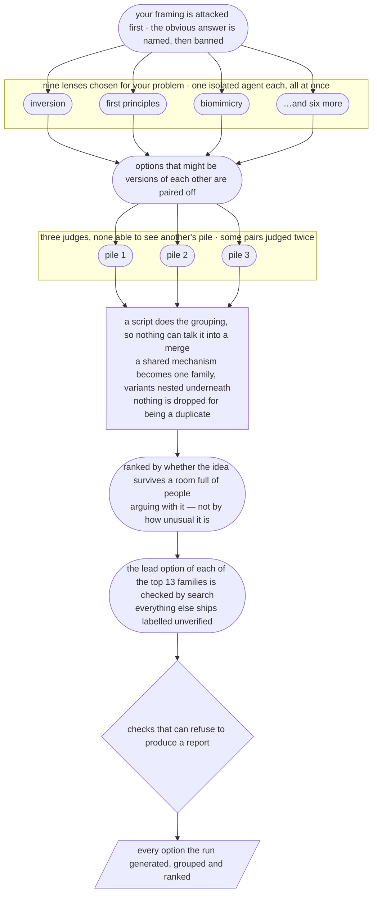

# Creative Problem Solving

[](https://yaniv-golan.github.io/creative-problem-solving/static/install-claude-desktop.html)

[](https://opensource.org/licenses/MIT)
[](https://agentskills.io)
[](https://github.com/yaniv-golan/creative-problem-solving/actions/workflows/ci.yml)

**Gets you options you hadn't already thought of.** You describe a problem you're stuck on; it
comes back with structurally different things you could do — not five variations on the obvious
answer with different headings.

**Tested on Claude.** It is built on the open [Agent Skills](https://agentskills.io) standard,
so it should install and run on ChatGPT and on other hosts that implement the standard — but
those have not been tested, and the `/ideas` pipeline in particular needs sub-agent dispatch,
`python3` and web search, which not every host provides. **[Install →](INSTALL.md)**

## What it looks like

You type this:

```
/creative-problem-solving:ideas   We keep losing senior engineers to bigger companies at around
the 18-month mark. Comp is already competitive — we benchmark and we match. It's not the money.
What can we actually do about this?
```

It refuses to take your framing on trust, and tells you what to measure first:

> **Before any of this: you don't yet know which clock is running.** Four candidates — (a) it's
> a calendar artefact, a vesting event or a hiring-cohort spike rather than an experience curve;
> (b) the build they were hired for shipped and the job went custodial; (c) someone above them
> stopped growing the size of decisions they own; (d) the company stopped opening new hard
> problems faster than they finish them. Cheapest way to separate them: plot every departure
> against two dates — their start date, and the date their biggest project shipped or got
> cancelled.

Then it gives you options that differ in kind, each with what has to be true, how it fails, and
who would actually have to run it:

> ### Treat unsolved problems as a stock with a depletion rate
>
> A strong person consumes the hard problems that existed when they arrived, at a rate. If you
> open new fronts more slowly than that, a fixed-tenure exit is arithmetic, not sentiment — and
> every people-side intervention is treating a roadmap problem with an HR instrument. Count it
> directly: how many genuinely unsolved, consequential problems are open right now, and how many
> people do you have who could lead one? Below 1:1 and the 18-month number is your answer rather
> than your mystery.
> - What has to be true: your market supports opening new fronts.
> - Failure mode / cost: opening fronts you can't fund produces a graveyard of cancelled
>   projects, which loses the same people faster.
> - Who runs it: the CEO. This is a company-shape decision, not a management one.

Verbatim from a graded run, not a mock-up — a run of the 0.1.0 pipeline, which reported a
handful of options after pruning the rest. A run today generates hundreds across nine lenses and
presents all of them, grouped into families with the variants nested underneath. The options it
leads with take the shape above; the nested variants are a line each. The
[full answer](evals/transcripts/iteration-5/eval-5-holdout-retention/with_skill/outputs/response.md)
is in this repo, next to
[what the same model produced without the skill](evals/transcripts/iteration-5/eval-5-holdout-retention/without_skill/outputs/response.md)
— and on that same problem the baseline beat it on one point worth reading: the baseline
refused the "it's not the money" premise and was right to, while the skill took it at face
value. That loss is what produced the premise-testing step you see above.

## What you get

- **Your brief gets attacked before the solution space does.** It restates your problem as the
  job to be done, drops the loaded words from your phrasing — models reliably echo your
  vocabulary back at you — names the obvious answer so you can measure distance from it, and
  tests the constraints you ruled out. "It's not the money" is a conclusion, not a fact.
- **Options that differ in kind, not in degree.** One isolated sub-agent per lens, dispatched
  in a single parallel batch, each told which lens to use and forbidden the obvious answer.
  They cannot see each other, so they cannot drift toward one another — what a pass cannot see,
  it cannot regress toward.
- **Ideas you can act on or reject, not admire.** The three it puts at the top carry a causal
  mechanism, a precondition, a failure mode, and who would actually have to run it — and the
  report cannot be finished without them, because the script that builds it leaves those fields
  as blanks and refuses a report that still has one. The next ten get a sentence each on why
  they rank there, and everything after that is listed in rank order. Throughout, variants
  arrive as one line each under the option they are a variant of. Options that quietly disqualify themselves —
  "that's a different firm now" — are named as such rather than presented as answers.
- **Claims you can check.** Never "this is novel" — instead "I found no prior art, here's where
  I looked, and here's who'd already be doing it if it were obvious." When prior art *is* found
  the idea is labelled **buyable rather than inventable**, which is usually more useful.

## When it runs, and when it refuses

**Ask for it directly. That is the only way in.** A full run takes about forty minutes and
returns a long document, so it has to be your decision rather than something inferred from how
you phrased a question. The skill does not select itself: its description tells a model to run
it only on an explicit request, and to answer ordinary questions about ideas or options
directly instead.

In Claude Code and Claude Desktop the decision is a command:

```
/creative-problem-solving:ideas   Our onboarding drop-off is 60% and the obvious fixes are spent
```

Most hosts accept the bare `/ideas` when nothing else claims the name. On hosts without slash
commands, asking plainly does the same job: *"use creative problem solving on this"*.

Claude Code also auto-exposes the skill as `/creative-problem-solving:creative-problem-solving`.
Use `:ideas` instead — under test, the auto-exposed form did not actually invoke the pipeline.

**It will not offer itself.** Asking for ideas, options, angles or approaches — or naming a
method like SCAMPER, TRIZ or first principles — gets you a direct answer, which for most
questions is the right one. When you want the pipeline, say so, and put the problem in the same
message:

```
/creative-problem-solving:ideas   Our onboarding flow has a 60% drop-off at the
account-verification step. We've already tried shortening the form and adding a
progress bar. I'm out of ideas.
```

```
use creative problem solving on this: our architecture practice is 60 people and fees
are compressing. We've tried raising utilisation and hiring cheaper juniors. I don't
think this model survives four more years — what else could we be?
```

Both of those problems are the kind it is for. Neither would start a run without the first
few words, and that is the point.

**It deliberately refuses** problems with one right answer, debugging, executing an
already-chosen idea, or anything where you want a decision rather than options. Asked
"Postgres or MongoDB for session storage?", it declines and just answers the question.

**Grounded, always.** Before generating, it retrieves what already exists and hands that list to
every pass as a difference constraint — *your ideas must not be any of these*. Afterwards it
checks by search the borrowed mechanism behind the lead option of each of the top 13 families, and cuts
what does not check out. Nested variants and the surrounding judgement are not checked. Everything below that ships explicitly labelled unverified, with an
offer to check any of it on request. Naming which options were checked beats implying all of
them were.

**Nothing is deleted for being a duplicate** — the one exception above is a borrowed mechanism
that fails verification, which is a fabrication rather than an option. Options that propose the
same core intervention are grouped into a family and shown together, each variant stating what
differs. A mechanism reached from several unlike angles gets one place in the ranking rather than
several — but every one of them stays visible. A wrong merge is unrecoverable; a wrong grouping
costs a line of reading.

That is enforced rather than requested. An integrity script fails the run if any of this is not
true: every generated option is either presented or explicitly rejected by a search that refuted
it, every option sits in exactly one family, and nothing is presented as verified without a
source. The rule exists because automated deduplication could not be trusted with the decision —
asked to remove duplicates from one pool it removed wildly different numbers each time, and most
of what it called a duplicate turned out to be a variant worth reading.

## How a run works

You give it the problem in your own words. It restates that as the job to be done, names the
obvious answer and then bans it, and sends the problem to nine lenses at once — inversion, first
principles, biomimicry and six more — each worked by an agent that cannot see what the others are
writing. That isolation is the whole reason the options come back different in kind: what a pass
cannot see, it cannot drift toward.

Everything generated then gets kept. Options that turn out to be versions of each other are
paired off and judged blind, a script groups them into families, and the families are ranked by
whether the idea would survive a room full of people arguing with it. The leading options get
fact-checked; the rest arrive labelled as unchecked. What lands is one long document containing
every option the run produced.



Rounded boxes are a model making a judgement; the square one is a script doing bookkeeping. The
split is worth noticing, because it is what the run can and cannot be argued out of: a model can
be persuaded that two options are really the same idea, and a script counting files cannot. The
pairs judged twice are there so the run can tell you, in its own closing line, how much its
grouping is worth.

Some real steps are left out to keep this readable. The stages as the model actually runs them
are in [`references/pipeline.md`](creative-problem-solving/skills/creative-problem-solving/references/pipeline.md).

## Does it actually work?

Partly, and the honest version is worth two minutes.

**What is measured about the pipeline you would install is thin, and it is all here.** Two full
runs have completed end to end; two more stalled and were fixed. On 50 blind cards from one
problem, one judge, one question: the pipeline's 25 options were **all** new to the reader and 15
were ones he would not spend anyone's time on, against a well-prompted plain model's 9 of 25
worth bringing. That is roughly **21 useful ideas against 18, at twenty times the wall-clock**.
Novelty and usefulness turned out close to orthogonal on that data, which is why unusualness is
explicitly not a ranking tiebreak. Two things landed after that measurement — a per-lens quota
and the survivability ranking — and neither has been measured.

**The graded evals have not been re-run against this architecture, and that is a decision rather
than an oversight.** Everything in [`evals/`](evals/README.md) measures the pipeline as it stood
at 0.1.0. The cases are runnable now, one `cowork-harness run` each, and they are sequenced after
this release rather than before it — the release is what makes the thing being measured the thing
you can install. First back will be the negative-trigger case and the bounded case where a plain
answer previously beat the skill, which are the honest two to start with rather than the
flattering ones.

Three limits worth knowing before you spend forty minutes.

**The same problem does not group the same way twice.** Run it twice and you get a different
number of families, each grouping individually coherent — about what two editors organising the
same material would do. Read the families as a way through the list, not as a property of the
problem.

**Grouping often does less work than it sounds like.** How much the list actually shortens varies
a lot. Across five recorded runs the share of judged pairs called outright duplicates ranged from
19.5% down to 0.7%, and the grouped list came out anywhere from 3.3x shorter to **1.4x shorter**.
In the two runs at the bottom of that range, **about 90% of families held a single option** — the
report is then essentially the full list with a handful of near-repeats tucked together. That is
an ordinary outcome rather than a broken one: options drawn from nine deliberately unlike angles
often are not versions of each other. Expect families to save you rereading some repetition, not
to turn three hundred options into thirty.

**No count of "distinct options" is reported anywhere**, because that number is not measurable.

Against those, one thing you do get: **every run reports how much to trust its own grouping.**
Forty-eight pairs are deliberately planted twice, so that two adjudicators who cannot see each
other judge the same pair, and the agreement rate is printed in the answer — so far it runs at
roughly 80-90%. A run where fewer than forty of them came back from two different
adjudicators fails rather than reporting a rate it cannot support. That is also the likeliest
explanation for the variance above, since a grouping is built from thousands of these judgements.

### What the earlier architecture measured

These are the strongest numbers this project has, and they describe the **previous** pipeline —
sequential passes in one context, two modes, a pruned shortlist — rebuilt on 2026-08-23 into what
this README describes. They are kept because a negative result nobody publishes is worth nothing,
and because the method is the part that carries over.

**On one strategic problem**, five runs per arm, blind-judged: **6.60 structurally distinct
options against a plain prompt's 4.00**, and it tested a premise the asker supplied in 5/5 runs
against the baseline's 4/5. A judge shown the ten answers unlabelled, asked only whether they
fell into groups, split them **10/10 along the arms** without being told arms existed.

**Three things that cut the other way**, all measured, all published here:

- The experiment pre-registered **two** prompts and required an effect on both. **Both have now
  run, and the second did not clear**: +0.60 mechanisms against a pre-registered threshold of
  1.0. Per the pre-registered rule that is a split, so the effect above is claimed for one prompt
  only. A clean re-measurement on a single skill build put the same comparison at **+0.00 and
  +1.00 under two different judges scoring the same ten answers** — a between-judge spread equal
  to the whole detection threshold. See
  [`evals/results/vs-plain-prompt.md`](evals/results/vs-plain-prompt.md).
- **On bounded questions a plain answer beats it** — 17/18 to 14/18. Nothing stops you spending
  forty minutes on a question that deserved five; that judgement is yours.
- Removing the two mechanisms this skill named as load-bearing cost **less than the judge's own
  noise floor**. Where the value actually comes from is not yet located.

All of it is reproducible from [`evals/`](evals/README.md) — definitions, per-assertion grading,
and the full transcript of every run in both configurations. Category negation — generating
again *outside* your own clusters, which beat every classical creativity method in head-to-head
testing — is deliberately in the skill and not in the pipeline;
[`DESIGN-NOTES.md`](docs/DESIGN-NOTES.md) carries the round that decided it.

## Requirements

**The skill alone is prose** — six files, nothing executable. That is what the release zip and
the `.agents/skills/` mirror contain, and any host implementing the Agent Skills standard should
be able to load it. Claude is the only one this has been tested on.

**The `/ideas` pipeline asks for more**, because the things that make it auditable are not
prose:

- **Sub-agent dispatch.** Generation runs one isolated agent per lens; without dispatch the
  skill falls back to sequential passes and is required to tell you it did.
- **`python3` and a Bash tool.** Stdlib-only scripts do the set bookkeeping — sharding the
  candidate pairs, merging the adjudicators' verdicts, partitioning the options into clusters and
  reassembling those into families, building the report and checking the finished run. They
  exist because a model that skipped a stage describes having run it
  exactly as convincingly as one that ran it, and a script counting files cannot make that
  claim: a stage that did not run leaves nothing to count.
- **Web search**, where the host provides it. Where it doesn't, the skill says so in one line
  and states borrowed mechanisms as principles rather than citations, rather than quietly
  presenting unchecked claims at the same confidence as checked ones. Verification uses
  WebSearch specifically, not WebFetch — under Cowork's host loop WebFetch is aliased to a gated
  tool and a verifier reaching for it stalls on an approval that never arrives.

A host missing any of these still runs the skill; it runs a weaker version of it and says so.

**A run leaves a directory behind, on purpose.** `/ideas` writes everything it produces under
`outputs/<timestamp>/` in its working directory: the report, every option generated, the
adjudicators' verdicts, and `_work/brief.json`, which holds your problem as you stated it.
**Nothing under `outputs/` is ever deleted** — not the current run, not older ones.
That is deliberate rather than an oversight. The integrity check counts what is on disk, so a
stage file that was tidied away is indistinguishable from a stage that never ran, and a pipeline
that can delete its own evidence cannot prove it did not skip a step. Old run directories
accumulate; they are small, and clearing them is your call, not the run's. If you invoke `/ideas`
inside a git repository, add `outputs/` to its `.gitignore` — the contents are yours, and
committing them is rarely what you want.

**Where that directory is depends on the host.** Run from a terminal, it is the directory you
invoked from and everything above holds as written. Run inside an assistant that gives the session
its own working area, the run directory belongs to that session rather than to you, and it may not
outlive it — which is why the run also hands you the report as a file to open and keep, and sends
its full contents in the reply. If you want the working files, say so and they can be handed over
too; the guarantee that nothing is deleted is about the run never tidying away its own evidence,
not a promise about where your host keeps it.

## Built with

Three tools did the work that isn't the skill itself, and each is worth naming because it is
what makes the claims here checkable rather than asserted:

[](https://github.com/yaniv-golan/skill-creator-plus)
[](https://github.com/yaniv-golan/cowork-harness)
[](https://github.com/yaniv-golan/skill-packager-skill)

- **[skill-creator-plus](https://github.com/yaniv-golan/skill-creator-plus)** built the first
  version of this skill.
- **[cowork-harness](https://github.com/yaniv-golan/cowork-harness)** runs the behavioural
  scenarios in [`tests/`](tests/README.md) — the checks that assert what the skill *does*
  (declines a decision question, does no research on a bounded one) against a real sandboxed
  agent rather than against a grader's opinion. Its `--ablate-skill` flag produced the negative
  control for the v0.1.0 experiments — the ones that state their method in
  [`evals/`](evals/README.md) — and it runs the eval cases themselves, which are
  [scenarios](evals/scenarios/) now rather than a description of a measurement.
- **[skill-packager](https://github.com/yaniv-golan/skill-packager-skill)** generates the
  plugin manifests and the release archive from
  [`skill-packager.json`](skill-packager.json), which is why one skill installs across nine
  hosts without nine hand-maintained manifests.

## Contributing

Issues and PRs welcome. **A bad answer, with the real prompt and the real output, is the single
most useful report** — several rules in `SKILL.md` exist because a specific run went wrong.

Start with [CONTRIBUTING.md](CONTRIBUTING.md), which covers the repo layout, the bar for
pipeline changes, and how to run the tests. If you are changing the pipeline, read
[`DESIGN-NOTES.md`](docs/DESIGN-NOTES.md)
first — several instructions that look redundant are load-bearing, and the notes record which
shortcuts have already been tried and what they cost.

By participating you agree to the [Code of Conduct](CODE_OF_CONDUCT.md). Security reports go
through [SECURITY.md](SECURITY.md), not the public issue tracker.

## License

MIT — see [LICENSE](LICENSE).
