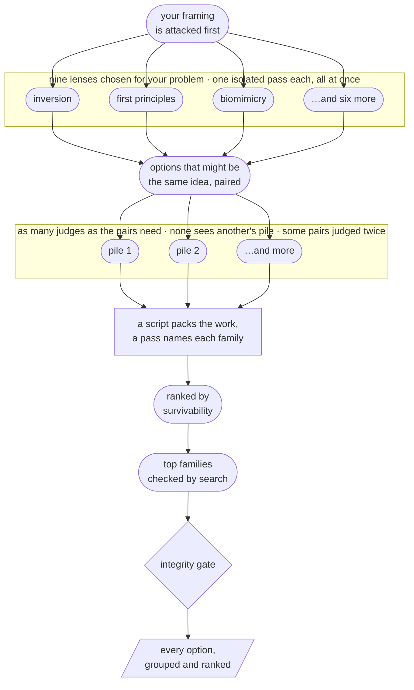

# Creative Problem Solving

[](https://yaniv-golan.github.io/creative-problem-solving/static/install-claude-desktop.html)

[](https://opensource.org/licenses/MIT)
[](https://agentskills.io)
[](https://github.com/yaniv-golan/creative-problem-solving/actions/workflows/ci.yml)

**Gets you options you hadn't already thought of.** You describe a problem you're stuck on. It
comes back with structurally different things you could do — not five variations on the obvious
answer with different headings. A run takes about half an hour and hands back one long document:
hundreds of options across nine lenses, grouped into families, ranked, the leading ones
fact-checked.

**Tested on Claude.** It is built on the open [Agent Skills](https://agentskills.io) standard
and should run on other hosts that implement it, but none have been tested.
[What a run needs →](#requirements)

**[Install →](INSTALL.md)**

## What it looks like

You type this:

```
/creative-problem-solving:ideas   We keep losing senior engineers to bigger companies at around
the 18-month mark. Comp is already competitive — we benchmark and we match. It's not the money.
What can we actually do about this?
```

It refuses to take your framing on trust. Its closing read tells you what to measure before you
spend a quarter on anything else:

> […] before any of it, spend an hour testing the premise you ruled out, because 'we benchmark
> and we match' is almost always benchmarked against **day-one offers**, while the comparison an
> engineer actually runs at month 18 is whatever is left unvested and unrealised on their side
> against a large employer's liquid annual refresher plus a fresh grant; compute realizable
> 24-month value for the last three people who left versus the offer they took, and **if the gap
> is over about 10% then it is still the money and most of this list is the wrong list.**

Then it gives you options that differ in kind, each with what has to be true, how it fails, and
who would actually have to run it:

> ### 3. Grant personal hiring authority over a team they recruit
>
> Let anyone past 18 months propose a new unit, and if accepted give them the headcount
> requisitions, budget line and hiring authority to staff it themselves.
>
> *Checked — [insperity.com](https://www.insperity.com/blog/what-is-intrapreneurship-and-why-should-it-be-part-of-your-hr-strategy/)*
>
> *Note — Confirms that intrapreneurship programs — employees proposing and running internal
> ventures with dedicated budget and manpower — are a real, documented practice with a claimed
> retention effect. The sources are practitioner/advisory writing, not controlled evidence, and
> none of them describe handing the proposer headcount requisitions and independent hiring
> authority, or an 18-month eligibility threshold. The delegation depth this option assumes is
> beyond what any source shows.*
>
> It ranks here because founding and staffing a team is the thing a mid-career engineer leaves to
> go and do, and it is far easier to grant inside a company your size than inside the one
> recruiting them — the eligibility gate then makes tenure the price of admission.
> - **What has to be true:** You are growing enough to have headcount worth handing over, and you
>   can live with a hiring bar set by someone who has never hired before.
> - **Failure mode / cost:** A bad hire made under personal authority is politically expensive to
>   reverse, and a rejected proposal is an accelerant — someone who pitches a unit and is turned
>   down leaves faster than if you had never opened the door.
> - **Who runs it:** The founder or CTO; this is a delegation of a hiring mandate and nobody below
>   that level can actually grant it.
>
> - Let each specialist personally hire and direct two people of their choosing on a problem they
>   chose, so leaving means abandoning colleagues they recruited rather than colleagues assigned
>   to them.
> - *[two further variants omitted here]*
> - *Proposed by 4 of the 9 passes.*

The indented lines at the end are other options that proposed the same intervention: kept and
nested under the one they vary, never deleted. From a run on 2026-09-01, quoted as it was
written except for the marked cuts and the bolding: 271 options across nine lenses, grouped
into 114 families, 28 minutes. The
[full report](evals/transcripts/capture-2026-09-01-retention/outputs/report.md) is in this repo
with [what the run measured about itself](evals/transcripts/capture-2026-09-01-retention/capture_metadata.json).

## When it runs, and when it refuses

**Ask for it directly. That is the only way in.** A full run takes about half an hour, spreads
the work over about thirty separate jobs, and returns a long document — so the run is yours to
start, never something a phrasing triggers. On the metered API the run quoted above cost about
$21; on a subscription it takes a matching bite out of your usage. In Claude Code and Claude
Desktop that decision is a command:

```
/creative-problem-solving:ideas   Our onboarding drop-off is 60% and the obvious fixes are spent
```

Most hosts accept the bare `/ideas` when nothing else claims the name. On hosts without slash
commands, asking plainly does the same job: *"use creative problem solving on this"*.

Before it starts, it shows you what it thinks you are asking, who has to act, and the pressures
it invented, and it asks two things: what you have already ruled out, and what would count as
solved. Say "go" or correct it. It asks once. Put *"don't ask me any questions"* in your problem
and it says the reading and starts.

**It will not offer itself.** Asking for ideas, options, angles or approaches — or naming a
method like SCAMPER, TRIZ or first principles — gets you a direct answer, which for most
questions is the right one. When you want the pipeline, say so, and put the problem in the same
message:

```
/creative-problem-solving:ideas   Our onboarding flow has a 60% drop-off at the
account-verification step. We've already tried shortening the form and adding a
progress bar. I'm out of ideas.
```

```
use creative problem solving on this: our architecture practice is 60 people and fees
are compressing. We've tried raising utilisation and hiring cheaper juniors. I don't
think this model survives four more years — what else could we be?
```

Both are the kind of problem it is for, and neither would start a run without the first few
words.

**It deliberately refuses** problems with one right answer, debugging, executing an
already-chosen idea, or anything where you want a decision rather than options. Asked
"Postgres or MongoDB for session storage?", it declines and just answers the question.

## How a run works

You give it the problem in your own words. It restates that as the job to be done, names the
obvious answer, and bans it. Then it sends the problem through nine lenses at once — inversion,
first principles, biomimicry and six more. Each lens is worked by a pass that cannot see what the
others are writing: what a pass cannot see, it cannot drift toward. Everything generated is kept,
paired off, judged blind, gathered into families, and ranked.



Rounded boxes are judgement calls the model makes; the square one is a script counting what came
back, which is the arithmetic no model is trusted with. Two things the picture cannot show: that
last gate can refuse to produce a report at all, and several smaller steps are left out here for
readability. The stages as the model runs them are in
[`references/pipeline.md`](creative-problem-solving/skills/creative-problem-solving/references/pipeline.md).

<details>
<summary><strong>The nine lenses, in one line each</strong></summary>

Which nine are used depends on the problem. Each is worked by its own pass that cannot see the
others, which is why they come back with different kinds of answer rather than nine wordings of
one. `SKILL.md`'s Phase 1 table is the operative version; this is the plain-language summary.

| Lens | What it does |
|---|---|
| **Contradiction (TRIZ)** | Finds the trade-off everyone treats as a law — "fast or cheap, pick one" — and refuses it. Usually the law turns out to be a habit. |
| **First principles** | Strips the problem to what is actually true, labels each assumption *law*, *regulation* or *convention*, bins every convention, and rebuilds. |
| **Inversion** | Solves the opposite problem and flips the answer. "How would we make this worse?" is often the easier question. |
| **Constraint extremity** | Does it with a hundredth of the money, in a week, or with nobody. Whatever replaces the impossible approach is the idea. |
| **Time-shift** | Assumes today's bottleneck is free and unlimited, then asks what becomes scarce because of that. The new bottleneck is where the value moves. |
| **Analogical transfer** | Finds a distant field that solved the same *function* and ports its mechanism. A comfortable analogy is too close to be worth much. |
| **Biomimicry** | The same, from biology, naming organism and mechanism — then strips the biology off before applying it. |
| **Morphological** | Builds a grid of dimensions and options and combines them. Cutting the self-contradictory combinations is the method; without that it is a filler machine. |
| **Actor reversal** | Makes the customer the supplier, or the reverse, and describes the business from that side. |

SCAMPER and Six Thinking Hats are deliberately demoted — they decorate a single pass with headings
rather than forcing a different starting point. The reasoning is in
[`references/lenses.md`](creative-problem-solving/skills/creative-problem-solving/references/lenses.md).

</details>

## What you get

- **Your brief gets attacked before the solution space does.** It restates your problem as the
  job to be done and drops the loaded words from your phrasing, since models reliably echo your
  vocabulary back at you. It names the obvious answer so you can measure distance from it, and
  tests the constraints you ruled out. "It's not the money" is a conclusion, not a fact.
- **Grounded before it generates.** It retrieves what already exists and hands that list to every
  pass as a difference constraint: *your ideas must not be any of these*.
- **Options that differ in kind, not in degree.** One isolated pass per lens, all dispatched at
  once, each told which lens to use and forbidden the obvious answer. They cannot see each other,
  so they cannot drift toward one another.
- **Ideas you can act on or reject, not admire.** The top three carry why they rank there, what
  has to be true, how they fail and who would have to run them. The script that builds the report
  leaves those four fields blank and refuses a report that still has one. The next ten get a
  sentence each on why they rank there, and everything after that is listed in rank order.
  Options that quietly disqualify themselves — "that's a different firm now" — are named as such.
- **Claims you can check.** Never "this is novel." Instead: "I found no prior art, here's where
  I looked, and here's who'd already be doing it if it were obvious." When prior art *is* found,
  the idea is labelled **buyable rather than inventable** — usually the more useful answer.
- **You are told what was checked.** Search checks the borrowed mechanism behind the lead option
  of each of the top 13 families. Nested variants and the surrounding judgement are not checked,
  and everything below that line ships labelled unverified. Naming which options were checked
  beats implying all of them were.
- **Nothing is deleted for being a duplicate.** Options proposing the same intervention are
  grouped into one family, each variant stating what differs, and every one of them stays
  visible. An integrity script enforces it.
- **Every run reports how much to trust its own grouping.** Forty-eight pairs are planted twice,
  so two judges who cannot see each other rule on the same pair, and the agreement rate is
  printed in the answer. On the run captured in this repo it was 40 of 48 pairs — **83%** — and
  across the runs on record it has ranged from **75% to 90%**, so somewhere between one judged
  pair in four and one in ten is a coin toss between two readers of the same evidence. A run
  where fewer than forty pairs come back from two different judges fails instead of printing a
  rate it cannot support.

## What it won't do

Three limits worth knowing before you spend half an hour.

**The same problem does not group the same way twice.** Run it twice and you get a different
number of families, each grouping individually coherent — about what two editors organising the
same material would do. Read the families as a way through the list, not as a property of the
problem.

**Grouping often does less work than it sounds like.** How much the list actually shortens
varies a lot. Across the runs on record, the share of compared pairs judged outright duplicates
ran from about one in five down to under one in a hundred, and the grouped list came out
anywhere from three times shorter than the raw one to **barely shorter at all**. In the runs at
that bottom end, **about nine families in ten held a single option** — the report is then
essentially the full list with a handful of near-repeats tucked together. Options drawn from
nine deliberately unlike angles often are not versions of each other.

**No count of "distinct options" is reported anywhere**, because that number is not measurable.
A family count is a count of groupings, and the agreement rate under *What you get* says how far
two readers of the same evidence disagree about those.

## Reading the output

If the cause of your problem isn't known, the report opens with a diagnosis — read that first,
because it may change which options are relevant at all. Then the options in rank order. The top
three carry a mechanism, a precondition and a failure mode, plus who would run it wherever the
idea needs people or a mandate you don't have. Variants sit nested underneath the option they
vary, one line each. A **Checked and failed** block lists options a search refuted, each with its
source — where the auditability the rest of this page claims actually shows up. The ranking is
survivability, not novelty, so the top of the list is not its most unusual entry. It closes with
a point of view, not a summary.

The report arrives in the reply; on hosts that give the session their own working area, you also
get it as a file to keep. [Where a run writes its files →](INSTALL.md#where-a-run-writes-its-files)

## Does it actually work?

Well enough to be worth half an hour on an open strategic problem — on evidence thin enough
that you should know its shape before you trust it.

**One measurement covers the pipeline you would install.** Six runs have completed end to end,
two of them captured in this repo with everything they produced; two more stalled and were
fixed. The quality evidence behind all of it is a single reading: 50 blind cards from one
problem, one judge. All 25 of the pipeline's options were new to the reader; 15 were ones he
would not spend anyone's time on, leaving 10 he would. A plain model's 25 yielded 9 worth
bringing — and the pipeline spent twenty times the wall-clock to get there. Novelty and
usefulness came out close to orthogonal there, which is why unusualness is explicitly not a
ranking tiebreak. The per-lens quota and the survivability ranking are unmeasured.

The run shown at the top of this page was graded against two claims and met both: that it tests
a ruled-out premise instead of obeying it, and that at least one option questions the framing.
One run is not a rate.

**On bounded questions a plain answer beats it** — 17/18 to 14/18. The half hour and the spend
are the whole cost, and on a question that deserved five minutes it is a bad trade.

**The graded evals measure the 0.1.0 pipeline, not this one.** Re-running them is sequenced
after this release, starting with the negative-trigger case and the bounded case a plain answer
won — the honest two to begin with. Every 0.1.0 number, including the three findings that cut
against the skill, is in [`evals/`](evals/README.md). Why category negation is in the skill but
not in the pipeline is in [`DESIGN-NOTES.md`](docs/DESIGN-NOTES.md).

## Requirements

**The skill alone is prose** — ten files, nothing executable, and that is what the release zip
and the `.agents/skills/` mirror contain. Any host implementing the Agent Skills standard should
load it. Claude is the only one this has been tested on.

**A full run asks for more:**

- **Sub-agent dispatch.** Generation runs one isolated pass per lens as its own sub-agent;
  without dispatch the skill falls back to sequential passes and is required to tell you it did.
- **`python3` and a Bash tool.** Stdlib-only scripts do the bookkeeping — dealing the pairs out
  to judges, merging their verdicts, sorting the options into families, building the report,
  checking the finished run. A stage that did not run leaves nothing to count.
- **Web search**, where the host provides it — WebSearch specifically, not WebFetch. Where there
  is none, the skill says so in one line and states borrowed mechanisms as principles rather
  than citations.

A host missing any of these still runs the skill; it runs a weaker version of it and says so.
**So does a zip install, on any host** — those scripts ship with the plugin, not with the zip or
the `.agents/` mirror, and a run without them gives up the integrity check, the generated report
skeleton and the agreement rate above.
[What each install gives you →](INSTALL.md#what-you-are-installing)

**A run leaves a directory behind, on purpose**, and nothing under it is ever deleted — see
[where a run writes its files](INSTALL.md#where-a-run-writes-its-files).

## Built with

[](https://github.com/yaniv-golan/skill-creator-plus)
[](https://github.com/yaniv-golan/cowork-harness)
[](https://github.com/yaniv-golan/skill-packager-skill)

- **[skill-creator-plus](https://github.com/yaniv-golan/skill-creator-plus)** built the first
  version of this skill.
- **[cowork-harness](https://github.com/yaniv-golan/cowork-harness)** runs the behavioural
  scenarios in [`tests/`](tests/README.md) and the eval cases in [`evals/`](evals/README.md)
  against a real sandboxed agent.
- **[skill-packager](https://github.com/yaniv-golan/skill-packager-skill)** generates the plugin
  manifests and the release archive from [`skill-packager.json`](skill-packager.json).

## Contributing

Issues and PRs welcome. **A bad answer, with the real prompt and the real output, is the single
most useful report** — several rules in `SKILL.md` exist because a specific run went wrong.

Start with [CONTRIBUTING.md](CONTRIBUTING.md), which covers the repo layout, the bar for
pipeline changes, and how to run the tests. If you are changing the pipeline, read
[`DESIGN-NOTES.md`](docs/DESIGN-NOTES.md)
first — several instructions that look redundant are load-bearing, and the notes record which
shortcuts have already been tried and what they cost.

By participating you agree to the [Code of Conduct](CODE_OF_CONDUCT.md). Security reports go
through [SECURITY.md](SECURITY.md), not the public issue tracker.

## License

MIT — see [LICENSE](LICENSE).
